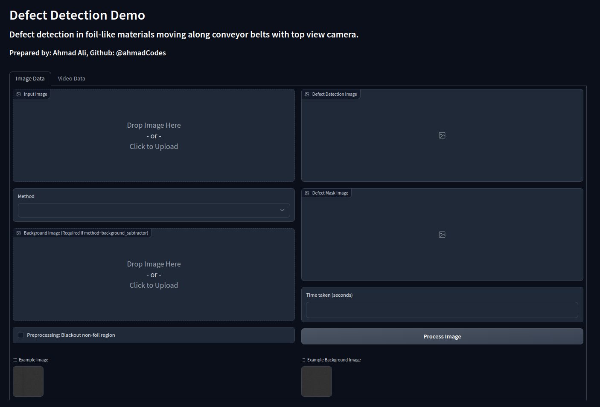

# Table of Contents

- [Defect Detection Library and GUI using Gradio](#defect-detection-library-and-gui-using-gradio)
  - [Introduction](#introduction)
  - [Getting Started](#getting-started)
    - [Requirements](#requirements)
    - [Installation](#installation)
    - [Installing the `defect_detector` Module as a Library](#installing-the-defect_detector-module-as-a-library)
      - [Installation Steps](#installation-steps)
      - [Verifying the Installation](#verifying-the-installation)
  - [Running the GUI App](#running-the-gui-app)
  - [How to Use the Defect Detection GUI](#how-to-use-the-defect-detection-gui)
    - [Image Data Tab](#image-data-tab)
    - [Video Data Tab](#video-data-tab)
  - [Using the `defect_detector` Module as a Library](#using-the-defect_detector-module-as-a-library)
    - [`ImageDefectDetector` Class](#imagedefectdetector-class)
      - [How to Use `ImageDefectDetector`](#how-to-use-imagedefectdetector)
    - [`VideoDefectDetector` Class](#videodefectdetector-class)
      - [Creating a `VideoDefectDetector` Object](#creating-a-videodefectdetector-object)
      - [Detecting Defects in a Video](#detecting-defects-in-a-video)
  - [Note](#note)


# Defect Detection Library and GUI App



## Introduction

Defect Detection GUI is a Gradio app that allows users to perform defect detection on images and videos using various defect detection methods given in the defect_detection library. The app provides a user-friendly graphical interface for easy interaction with the defect detection module. This repository contains the necessary code to run the app.

Defect detection is a crucial task in various industries, especially in manufacturing processes, where identifying defects in products is essential for ensuring quality control and minimizing waste.

## Getting Started

### Requirements

Before running the Defect Detection GUI and the library, ensure that you have the following prerequisites:

- **Python 3.10** installed on your system.
- Required libraries:
  - Gradio
  - NumPy
  - ultralytics (for object detection using yolov8n)
  - opencv-python

### Installation

You can install the required libraries using pip:

```bash
pip install -r requirements.txt
```

### Installing the `defect_detector` Module as a Library
To use the `defect_detector` module as a library, you can install it via `pip`. The module requires a few dependencies, which are listed in the `requirements.txt` file.

#### Installation Steps
- Clone this repository to your local machine or download the source code as a ZIP archive.
- Navigate to the root directory of the defect_detector project where the setup.py and requirements.txt files are located.
- Open a terminal or command prompt in that directory.
- Run the following command to install the module and its dependencies:
```bash
pip install .
```
This will install the defect_detector module along with the required dependencies listed in the requirements.txt file.

#### Verifying the Installation
To verify that the defect_detector module is installed correctly, you can run the following Python code in a script or Python interpreter:

```python
import defect_detector

# Test the ImageDefectDetector class
image_detector = defect_detector.ImageDefectDetector()
print(image_detector) # ImageDefectDetector(method=edge_detector)

# Test the VideoDefectDetector class
video_detector = defect_detector.VideoDefectDetector()
print(video_detector) # VideoDefectDetector(method=background_subtractor)
```
## Running the GUI App

To run the Defect Detection GUI, follow these steps:

- Clone this repository to your local machine.
- Navigate to the directory containing the repository.
- Run the defect_detection_app.py Python script using the following command:

```bash
python defect_detection_app.py
```
The Gradio app will be launched in your default web browser. Follow the link in the terminal e.g. `http://127.0.0.1:7861` to open the GUI on your web browser.

## How to Use the Defect Detection GUI
The Defect Detection GUI provides two tabs for processing **image** and **video** data. The app allows you to choose from different defect detection methods.

### Image Data Tab
- Upload an image that you want to analyze for defects by clicking on "Choose File" under "Input Image."

- Select a method from the dropdown list. The available methods are:
    - Edge Detector: Detect defects based on edges in the image.
    - Background Subtractor: Perform background subtraction to identify defects.
    - Gradient Threshold Detector: Detect defects using gradient thresholding.
    - Otsu Threshold Detector: Use Otsu's method for thresholding to find defects.
    - Kalman Residual Detector: Detect defects using Kalman filter residuals.
    - Object Detector: Detect defects using an object detection model.


- If you choose the method "Background Subtractor," you will need to provide a background image by clicking on "Choose File" under "Background Image." This step is necessary for this specific method.

- Check the "Preprocessing: Blackout non-foil region" checkbox if you want to perform a preprocessing step to blackout non-foil regions in the image.

- Click on "Process Image" to initiate the defect detection process.

- The output will be displayed below the input section, showing the defect image, defect map, and the time taken for the detection process.

### Video Data Tab

- Upload a video that you want to analyze for defects by clicking on "Choose File" under "Input Video."
- Check the "Debug" checkbox if you want to visualize the processed video using OpenCV HighGUI.
- Click on "Process Video" to initiate the defect detection process.
- The output will be displayed below the input section, showing the defect video and the defect mask video.

## Using the defect_detection Module as a Library
The defect_detector library provides classes for defect detection in images and videos. Below are the details of the classes available in the library:

### `ImageDefectDetector` Class

The `ImageDefectDetector` class is used to detect defects in an image using the specified method. The available defect detection methods are:

- `edge_detector`
- `background_subtractor`
- `gradient_threshold_detector`
- `otsu_thresh_detector`
- `kalman_residual_detector`
- `object_detector`

#### How to Use `ImageDefectDetector`

Import the ImageDefectDetector class from the defect_detector library.
```python
from defect_detector import ImageDefectDetector
```
Create an instance of the ImageDefectDetector class, specifying the desired defect detection method.
```python
defect_detector = ImageDefectDetector(method="edge_detector")
```
Use the detect_defects method to detect defects in an image.
```python
# Load the image as a NumPy array
image = cv2.imread("path_to_image.jpg")

# Detect defects in the image
defect_detection_image, defect_mask, bboxes, timetaken = defect_detector.detect_defects(image)
```
The `ImageDefectDetector.detect_defects()` method expects a `background_image` parameter when the provided method is `background_remover`

```python
from defect_detector import ImageDefectDetector

method = "background_subtractor"  # Choose any method from the available methods
image_defect_detector = ImageDefectDetector(method)

# Example image
image = ...  # Your image as a NumPy array

# Optional background image for "background_subtractor" method
background_image = ...  # Background image as a NumPy array (Required for "background_subtractor" method)

# Optional flag to blackout non-foil region
non_foil_blackout = True  # Set to True if you want to blackout non-foil region

# Detect defects in the image
defect_image, defect_mask, bboxes, detection_time = image_defect_detector.detect_defects(image, background_image, non_foil_blackout)

```

The `detect_defects()` method returns a tuple containing the following items:

- `defect_image`: Annotated defect image (NumPy array)
- `defect_mask`: Defect map (NumPy array)
- `bboxes`: List of bounding boxes around detected defects
- `detection_time`: Time taken for defect detection in seconds

### `VideoDefectDetector` Class

The `VideoDefectDetector` class is used to detect defects in a video using the specified method. Currently, the only available method for video defect detection is "background_subtractor".

#### Creating a `VideoDefectDetector` Object
To use the `VideoDefectDetector` class, create an instance of the class with the desired defect detection method:

```python
from defect_detector import VideoDefectDetector

method = "background_subtractor"  # Currently, only "background_subtractor" method is available for video defect detection
video_defect_detector = VideoDefectDetector(method)
```

#### Detecting Defects in a Video
Once you have created a `VideoDefectDetector` object, you can use the `detect_defects()` method to detect defects in a video:

```python
# Example video file path
video_path = "path/to/your/video.mp4"

# Optional flag for debugging (will show the processed video using OpenCV HighGUI)
debug = False

# Detect defects in the video
output_defect_video, output_mask_video, frames_bboxes_list = video_defect_detector.detect_defects(video_path, debug)
```

The `detect_defects()` method returns a tuple containing the following items:

- `output_defect_video`: Path to the annotated defect video (str)
- `output_mask_video`: Path to the defect mask video (str)
- `frames_bboxes_list`: A list of lists, where each element in frames_bboxes_list contains a list of bounding boxes for the given frame in the video.


### **Note**

    - Make sure to replace `path/to/your/video.mp4` with the actual path to your video file.
    - The defect_detector module uses the OpenCV library for image and video processing. Ensure that you have OpenCV installed (pip install opencv-python) before using the module.
    - Feel free to import the `defect_detector` module into your own Python script or Jupyter Notebook and use these classes and methods to perform defect detection on your own image and video data.

    - For more detailed information on the methods, classes, and their parameters, refer to the docstrings in the `defect_detector` module.

## License

This project is licensed under the MIT License - see the [LICENSE](LICENSE) file for details.
